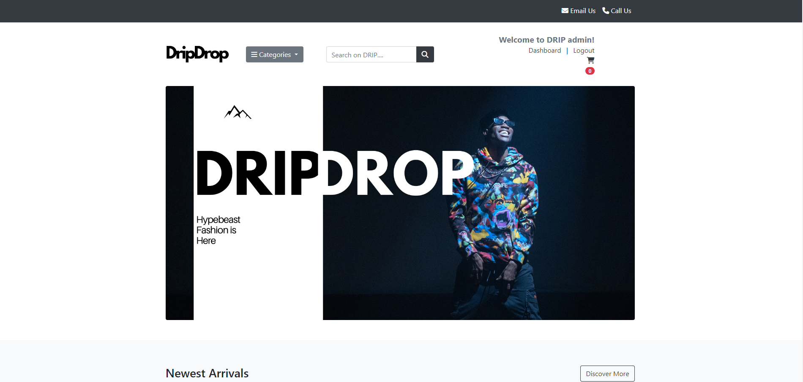

# Client - Management

Live Version: [e-commerce]()

Repository: [GitHub Repo](https://github.com/Omar-Alme/client-management-app)

The app is developed by [Omar Al-mehdhar](https://github.com/Omar-Alme)



## About

[E-commerce App](): Welcome to DripDrop - Your Ultimate Destination for Hypebeast Streetwear and Sneakers

DripDrop is not just another eCommerce app; it's a haven for enthusiasts of hypebeast streetwear and sneaker culture. Here, we bring together a curated collection of the most coveted brands and exclusive releases, making it easier than ever for fashion-forward individuals to stay ahead of the game.

What Sets DripDrop Apart?

Curated Selection: Say goodbye to endless scrolling through mediocre options. DripDrop offers a carefully curated selection of hypebeast streetwear and sneakers, ensuring that every item you find reflects the latest trends and highest quality.

Exclusive Releases: Get access to limited edition drops and collaborations from your favorite brands. At DripDrop, we pride ourselves on bringing you exclusive releases that you won't find anywhere else.

Seamless Shopping Experience: Our user-friendly interface and intuitive navigation make shopping on DripDrop a breeze. Whether you're browsing for the latest sneaker release or hunting for the perfect streetwear ensemble, you'll find everything you need with just a few taps.

Secure Transactions: Shop with confidence knowing that your transactions are secure. We prioritize the privacy and security of our customers, implementing robust measures to safeguard your personal information and payment details.

Fast Shipping: We understand that when you find the perfect piece, you want it ASAP. That's why we offer fast and reliable shipping options to ensure that your order reaches you in no time.


## User Experience 

### Target Audience

This app is for any business owner who wants to track their clients and save their most important information in one location.

### User Stories

| Issue ID    | User Story |
|-------------|-------------|
|[#1](https://github.com/Omar-Alme/client-management-app/issues/1)|As As a First Time Visitor I can understand the purpose of the website so that I can benefit from it|
|[#2](https://github.com/Omar-Alme/client-management-app/issues/2)|As a First time Visitor I can easily navigate around the website so that I can see the websites content|
|[#3](https://github.com/Omar-Alme/client-management-app/issues/3)|As a First time visitor and Business owner whose interested in the app I can register as a user so that I can access the benefits of the app.|


| Issue ID    | User Story |
|-------------|-------------|
|[#4](https://github.com/Omar-Alme/client-management-app/issues/4)|As a Returning user and business owner I can log in to my account so that I can access the app.|
|[#5](https://github.com/Omar-Alme/client-management-app/issues/5)|As a Frequent user I can recover my account in case i forget my password so that I can access my account again.|
|[#6](https://github.com/Omar-Alme/client-management-app/issues/6)|As a Registered user I can see my account and navigate through the pages so that I can use the benefits of the app|
|[#7](https://github.com/Omar-Alme/client-management-app/issues/7)|As a Registered User I can Edit my account profile was logged in so that I can have my own unique personal profile holding my details|
|[#8](https://github.com/Omar-Alme/client-management-app/issues/8)|As a Registered User I can change the standard profile image and add my own so that I can have my own profile|
|[#9](https://github.com/Omar-Alme/client-management-app/issues/9)|As a Registered user I can update my profile whenever I can so that I can be up to date with my details|
|[#10](https://github.com/Omar-Alme/client-management-app/issues/10)|As a Registered User I can add a client so that I can keep track of the clients that work for me|
|[#11](https://github.com/Omar-Alme/client-management-app/issues/11)|As a Registered User I can Input client details so that Have an insight of the client Im working with.|
|[#12](https://github.com/Omar-Alme/client-management-app/issues/12)|As a Registered User I can Upload a profile picture of the client or their company when I input their details so that see who im working with clearly|
|[#13](https://github.com/Omar-Alme/client-management-app/issues/13)|As a Registered User I can View the added client on my summary in a card summary so that I can keep track of certain details of the client|
|[#14](https://github.com/Omar-Alme/client-management-app/issues/14)|As a Registered User I can Update/Edit my client card details so that i can stay up to date with my clients|
|[#15](https://github.com/Omar-Alme/client-management-app/issues/15)|As a Registered User I can View my updated client card in the dashboard so that Stay on track with my client and stay up to date|
|[#16](https://github.com/Omar-Alme/client-management-app/issues/16)|As a Registed User I can click on the summarised client card to view a more detailed card so that I can see more details of my client such as online presense and their business description|
|[#17](https://github.com/Omar-Alme/client-management-app/issues/17)|As a Registered User I can Delete the client so that I can remove clients that I no longer work with|
|[#18](https://github.com/Omar-Alme/client-management-app/issues/18)|As a Registered User I can see the new dashboard when i delete a client so that I can stay up to date with my present clients|
|[#19](https://github.com/Omar-Alme/client-management-app/issues/19)|As a Registered User I can add a limited amount of clients so that Stay focused as a business owner and keep track of them|
|[#20](https://github.com/Omar-Alme/client-management-app/issues/20)|As a Registered User I can view all my client cards on my dashboard so that I can see everyone clearlly with the important detail summaries|


## Technologies Used

- ### Languages:

    + [Python](https://www.python.org/): primary language used for the server-side of the website.
    + [JavaScript](https://www.javascript.com/): primary language for the interaction of the website.
    + [HTML](https://developer.mozilla.org/en-US/docs/Web/HTML): Markup language for the website.
    + [CSS](https://developer.mozilla.org/en-US/docs/Web/css): styling language used to style the website.

- ### Frameworks and libraries:

    + [Django](https://www.djangoproject.com/): python framework used to create all the logic.
    + [jQuery](https://jquery.com/): was used to control click events and sending AJAX requests.
    + [Bootstrap](https://getbootstrap.com/): most popular CSS framework for developing responsiveness


- ### Databases:

    + [SQLite](https://www.sqlite.org/): the development database.
    + [PostgreSQL](https://www.postgresql.org/): the database used to store all the data.  
  
- ### Other tools:

    + [Git](https://git-scm.com/): version control tool to manage the code
    + [Pip3](https://pypi.org/project/pip/): the package manager used to install dependecies
    + [Gunicorn](https://gunicorn.org/): webserver used to run the website
    + [Psycopg2](https://www.python.org/dev/peps/pep-0249/): used to connect the database
    + [Django-allauth](https://django-allauth.readthedocs.io/en/latest/): the authentication library used to create users and authenticate them
    + [Heroku](https://www.heroku.com/): cloud platform used to host the website
    + [ElephantSQL](https://www.elephantsql.com/): the cloud database used to store all the data 
    + [Github](https://github.com/): used to store the websites source code
    + [VScode](https://code.visualstudio.com/): the IDE used to develop the websiteß
    + [Chrome Devtools](https://developer.chrome.com/docs/devtools/open/): was used to debug the website
    + [Font Awesome](https://fontawesome.com/): platform used to create icons for the website
    + [W3C HTML Validator](https://validator.w3.org/): validator used to validate the HTML5 code for the website
    + [W3C CSS Validator](https://jigsaw.w3.org/css-validator/): validator used to validate the CSS code for the website
    + [JShint](https://jshint.com/): validator used to validate JS code for the website
    + [PEP8](https://pep8.org/): validator used to validate python code for the website
    + [Whitenoise](https://whitenoise.readthedocs.io/en/latest/): pip package to serve static files so they can deploy anywhere
   


## FEATURES

Please refer to the [FEATURES.md](FEATURES.md) file for all features of the application.

## Design 

TThe application's design adheres to the principles of Material Design, emphasizing simplicity in user interaction. The primary focus is on ease of use, achieved through the intentional design of components to be user-friendly. By adopting a minimalistic approach, the goal was to create a meaningful and purposeful design without unnecessary distractions. Given the multifunctional nature of the application and its numerous components, the strategic use of white spaces was employed to enhance the overall user experience, contributing to a more visually pleasing and intuitive interface.

### Colour Scheme


In this application, a thoughtfully curated color scheme has been implemented to enhance the user experience. The choice of shades of black for the navigation bar and footer creates a sleek and professional appearance, ensuring optimal readability and visual appeal in these areas.

The white background at the center of the page serves a dual purpose. Firstly, it provides a clean and uncluttered canvas, placing the main content in focus. Secondly, it contributes to a modern and minimalist aesthetic, promoting a sense of simplicity and ease of use for the end user.

Shades of purple have been carefully integrated into buttons and subtext, adding a touch of vibrancy and highlighting key interactive elements. This not only aids in drawing attention to important features but also introduces a visually engaging element to the overall design.

In essence, the chosen color scheme aims to strike a balance between professionalism, user-friendly aesthetics, and a touch of vibrancy for an enriched visual experience.


### Typography

The font used throughout the application is Archivo.


ARCHIVO was chosen for its modern and clean design, aligning with the application's focus on simplicity and user-friendly aesthetics. Its versatility and readability enhance the overall visual appeal, contributing to a cohesive and contemporary design language.


### Wireframes

 - 
 - .png)
 - 
 - 
 - 

 These were the wireframes aimed for. However alot of the designs and features were changed or altered. The look was similar but there are features that were not accomplished due to lack of time. These will be added in the future. 
 
 Check [FEATURES.md](FEATURES.md) for future features.

### Flowchart


This is a simple flowchart used. The flowcharts were created using [LucidChart](https://www.lucidchart.com/).


## Information Architecture

### Database
In the project's initial phases, the database was established utilizing SQLite for its simplicity and lightweight nature. Subsequently, as the project evolved and required a more robust database management system, it was migrated to PostgreSQL to accommodate increased scalability and performance demands.

### Entity-Relationship Diagram

 +----------------+         +-----------------+
 |      User      |         |      Client     |
 +----------------+         +-----------------+
 | PK: id         |    +--->| PK: id          |
 | username       |    |    | FK: user_id     |
 | password       |    |    | client_name     |
 | email          |    |    | industry        |
 +----------------+    |    | email (unique)  |
                       |    | bio             |
                       |    | online_presence |
                       |    +-----------------+
                       |
 +----------------+    |
 |      Owner     |    |
 +----------------+    |
 | PK: id         |    |
 | FK: user_id    |    |
 | first_name     |    |
 | last_name      |    |
 | business_name  |    |
 | email (unique) |    |
 | bio            |    |
 | website        |    |
 +----------------+    |

### Data models

#### Client Model
+---------+--------------+---------------+------------------+-------+------------------+
| Field   | Type         | Blank         | Null             | Unique| Default          |
+---------+--------------+---------------+------------------+-------+------------------+
| id      | Primary Key  | Not Blank     | Not Null         |       |                  |
| user_id | Foreign Key  | Blank         | Not Null         |       |                  |
| client_name | CharField | Blank         | Blank            |       |                  |
| industry| CharField    | Blank         | Blank            |       |                  |
| email   | EmailField   | Blank         | Blank, Unique    | Yes   |                  |
| bio     | TextField    | Blank         | Blank            |       | No bio yet       |
| online_presence | URLField | Blank      | Blank            |       |                  |
+---------+--------------+---------------+------------------+-------+------------------+

#### Owner/User Model

+-----------+--------------+---------------+------------------+-------+------------------+
| Field     | Type         | Blank         | Null             | Unique| Default          |
+-----------+--------------+---------------+------------------+-------+------------------+
| id        | Primary Key  | Not Blank     | Not Null         |       |                  |
| user_id   | Foreign Key  | Blank         | Not Null         |       |                  |
| first_name| CharField    | Blank         | Blank            |       |                  |
| last_name | CharField    | Blank         | Blank            |       |                  |
| business_name | CharField| Blank         | Blank, Unique    | Yes   |                  |
| email     | EmailField   | Blank         | Blank, Unique    | Yes   |                  |
| bio       | TextField    | Blank         | Blank            |       | No bio yet       |
| website   | URLField     | Blank         | Blank            |       |                  |
+-----------+--------------+---------------+------------------+-------+------------------+

## Testing 

Please refer back to [TESTING.md](TESTING.md) file for all test-related documentation.

## Deployment 

 - The app was deployed to [Heroku](https://client-management-2b59dd79d4aa.herokuapp.com/)
 - The database was deployed to [ElephantSQL](https://www.elephantsql.com/).

### Local Deployment
In order to make a local copy of this project, you can clone it.
In your IDE Terminal, type the following command to clone my repository:

-      git clone https://github.com/Omar-Alme/client-management-app

*Note:*
  - This project requires to install all the requirements:
  - Open the terminal window and type:
  - `pip3 install -r requirements.txt`

1. Install the dependencies:

    - Open the terminal window and type:
    - `pip3 install -r requirements.txt`


2. Create a `.gitignore` file in the root directory of the project where you should add env.py and __pycache__ files to prevent the privacy of your secret data.

3. Create a `.env` file. This will contain the following environment variables:

    ```python
    import os

      os.environ['SECRET_KEY'] = 'Add a secret key'
      os.environ['DATABASE_URL'] = 'will be used to connect to the database'
      os.environ['DEBUG'] = 'True'
    ```

    *During the development stage DEBUG is set to True, but it is vital to change it to False.*

4. Run the following commands in a terminal to make migrations: 
    - `python3 manage.py makemigrations`
    - `python3 manage.py migrate`
5. Create a superuser to get access to the admin environment.
    - `python3 manage.py createsuperuser`
    - Enter the required information (your username, email and password).
6. Run the app with the following command in the terminal:
    - `python3 manage.py runserver`
7. Open the link provided in a browser to see the app.

8. If you need to access the admin page:
    - Add /admin/ to the link provided.
    - Enter your username and password (for the superuser that you have created before).
    - You will be redirected to the admin page.


### ElephantSQl Database Deployment

1. Go to [ElephantSQL](https://www.elephantsql.com/) and create a new account.

2. Create a new instance of the database.

3. Select a name for your database and select the free plan.

4. Click "Select Region"

5. Select a region close to you.

6. Click "Review"

7. Click "Create Instance"

8. Click on the name of your database to open the dashboard.

9. You will see the dashboard of your database. You will need the URL of your database to connect it to your Django project.

### Heroku Deployment

* Set up a local workspace on your computer for Heroku:
    - Create a list of requirements that the project needs to run:
      - type this in the terminal: `pip3 freeze > requirements.txt`
    - Commit and push the changes to GitHub
    
* Go to [www.heroku.com](www.heroku.com) 
* Log in or create a Heroku account.
* Create a new app with any unique name <name app>.


* Create a Procfile in your local workplace:

    
    This file will will contain the following:
    ```python
        web: gunicorn <name app>.wsgi:application
    ```
    - Commit and push the changes to GitHub.


* Go to the settings app in Heroku and go to Config Vars.


Click on Reveal Config Vars and add the following config variables:

| Key      | Value          |
|-------------|-------------|
| DATABASE_URL | ... | 
| DISABLE_COLLECTSTATIC | 1 |
| SECRET_KEY | ... |
| PORT | ... |
| DEBUG | ... |

* Copy the value of DATABASE_URL and input it into the .env file and generate a secret key (you may use [Djecrety](https://djecrety.ir/) for secret key generation).
* Create EMAIL_HOST_PASS and EMAIL_HOST_USER with a gmail account and add values to these keys.
* Migrate changes.
* Set debug to False in settings.py
* Commit and push the changes to GitHub.
* Connect your repository to Heroku.

  

* Deploy the app to Heroku by clicking "Deploy Branch" button. If you want to enable auto-deployment, click "Enable Automatic Deployment".


The deployment process will start.

Click "View build logs" to see the progress of the deployment.


*Due to security updates, Heroku dashboard will not allow you to deploy your app from GitHub. Thus, you need to run the following commands in your terminal:*

| action | terminal command | comment |
| ------ | ---------------- | ------- |
| login to your heroku account | `heroku login -i` | |
| create a new app on heroku | `heroku create NAME-OF-YOUR-APP` | if you haven't created the app before, and then, you can access the app via the Heroku dashboard and set up your config vars.|
| add remote to your local repository | `heroku git:remote -a NAME-OF-YOUR-APP` | if you have already created app on Heroku (before the security updates) and connected it using Heroku dashboard |
| deploy new version of the app | `git push heroku main` | |
| rename app | `git remote rename NAME-OF-YOUR-APP NAME-OF-YOUR-APP-2` | |

**Final Deployment**

* Set debug to False locally + delete DISABLE_COLLECTSTATIC from config vars in Heroku dashboard.
* Commit and push the changes to GitHub.


## Credits
 - Credits to all the softwares and tools used. Refer to the tools section of the README file.
 - [Freepik](https://www.freepik.com/free-vector/sign-page-abstract-concept-illustration_12291223.htm#query=sign%20up&position=5&from_view=search&track=ais&uuid=c42fbb6e-317d-42c1-8f9f-831deb639017): For some of the icons and images used across the application.
 - [Coding heroes](https://codingheroes.io/resources/): Credits to jonas Schmedtmann free resources website for developers
 - [Undraw](https://undraw.co/illustrations): For the illustration on the homepage.
 - [Programming with Mosh](https://www.youtube.com/watch?v=rHux0gMZ3Eg&t=895s): For helping understand django python a little more.
 - [FreeCodeCamp](https://www.youtube.com/watch?v=t10QcFx7d5k&t=3144s): for user authentication help.
 - [Dennis Ivy](https://www.youtube.com/watch?v=EX6Tt-ZW0so&t=985s): For Crud functionality help.

## Acknowledgments

 - [Juliia Konovalova](https://github.com/IuliiaKonovalova) For guiding me so much with everything and giving me tips and ideas for my project. Kept me grounded and patient when stressed.
 - Most importantly the Code institute Community and fellow students.


